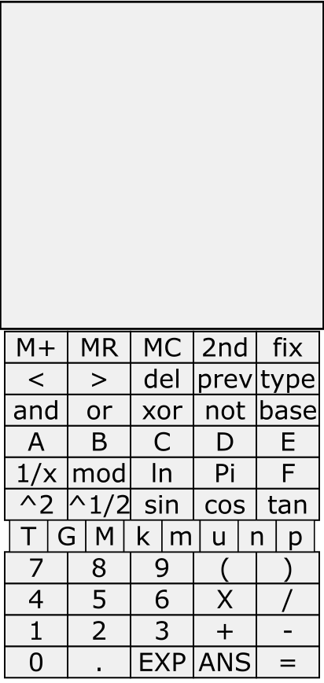

# asterisk_calc 

https://asteriskman7.github.io/asterisk_calc/

Prototype Image:

asterisk_calc will be an engineering calculator web page intended for use on a smartphone.

Special features:
* Buttons for entering SI prefixes like M (1e6) and n (1e-9)
* Mode for displaying result with SI prefixes
* Working with binary/hex values

Much development remains before it becomes usable.
